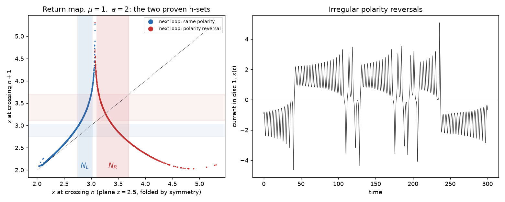

# Rikitake's dynamo is chaotic: a computer-assisted proof

**Moki&Julio · 2026** · DOI [10.5281/zenodo.23041182](https://doi.org/10.5281/zenodo.23041182)

In 1958 Tsuneji Rikitake proposed the simplest mechanical model of a planet's magnetic field flipping: two
spinning copper discs, each driving current through the other's coil. Its three equations

```
x' = -mu x + y z
y' = -mu y + (z - a) x
z' = 1 - x y
```

produce irregular, apparently random polarity reversals (x and y change sign together). The model has been
called chaotic since Ito's numerical study (Earth Planet. Sci. Lett. 51, 1980) and is used as a stock chaotic
system in hundreds of papers, but, as far as we could find, **its chaos has never been proved**. Its relatives have
been: the Lorenz equations (Galias–Zgliczyński, Mischaikow–Mrozek, Tucker), the Rössler equations
(Zgliczyński 1997), Lorenz-84 and others. This repository closes that gap for three parameter values.



## Theorem

Let (mu, a) be one of **(1, 2)**, **(1, 3.75)** or **(2, 5)**. [^params] Let Q be the first-return map of the
Rikitake flow to the plane z = c (crossings with z decreasing; c = 2.5, 4.0 and 5.8 respectively), folded by the
symmetry (x, y, z) -> (-x, -y, z). There are two disjoint compact sets N_L and N_R in that plane such that

* every orbit through N_L returns **without** a polarity reversal, and every orbit through N_R returns **with** one;
* Q satisfies the covering relations N_L ⇒ N_R, N_R ⇒ N_L and N_R ⇒ N_R.

Consequently (Zgliczyński–Gidea, J. Differential Equations 202, 2004):

1. **Every reversal pattern that never has two non-reversal loops in a row is realised by a true solution.** For any
   sequence of "reverse / don't reverse" with no two consecutive "don't", there is an exact solution of the
   equations whose successive loops follow exactly that sequence.
2. Every periodic such pattern is realised by a periodic orbit, so there are infinitely many periodic orbits.
3. The return map has a compact invariant set on which it is semi-conjugate to the golden-mean shift, so its
   **topological entropy is at least log((1+√5)/2) ≈ 0.481 per return**.

This is chaos in the sense of positive topological entropy and symbolic dynamics on an invariant set, the same kind
of statement proved for Rössler and (first) for Lorenz. It does not say that almost every orbit is chaotic, nor
that the attractor seen in simulations is exactly this invariant set.

[^params]: Values are the exact IEEE doubles written in `proof/design_*.txt`. (1, 3.75) is the case K = 2 in the
Cook–Roberts parametrisation a = mu(K² − K⁻²); (2, 5) is a value common in the modern chaos-control literature.

## How it is proved

1. **A good chart.** On the plane z = c the attractor is a thin curve. A fixed polynomial p (degree 8) is fitted to
   it once, and points are written in the global coordinates (u, s) = (x, y − p(x)), a homeomorphism of the plane.
   N_L = [l0, l1] × [−w, w] and N_R = [r0, r1] × [−w, w] in these coordinates (w = 0.01; 0.003 for (2, 5)).
2. **Rigorous Poincaré maps.** With the CAPD library (validated Taylor integration, interval arithmetic, order 20),
   each set is covered by small pieces; for each piece CAPD returns a guaranteed enclosure of its image, computed in
   coordinates aligned with the curve to avoid wrapping. Pieces that fail are bisected automatically.
3. **The inequalities.** For every piece: the return is transversal, the polarity outcome is the stated one, and the
   image satisfies |s| < w. For the four edges u = l0, l1, r0, r1: the images land strictly beyond the target sets
   (u < r0, u > r1, u > r1, u < l0 respectively). These are exactly the conditions for the covering relations, with
   a straight-line homotopy to a linear map.

Everything that matters for correctness is in interval arithmetic; the polynomial fit, the choice of the sets and
the choice of which direction to bisect are heuristics that can only make the check fail, never pass falsely.

## Results

| (mu, a) | plane z = c | N_L = [l0, l1] (≈) | N_R = [r0, r1] (≈) | w | pieces (checker A) | time, 1 core (≈) | result |
|---|---|---|---|---|---|---|---|
| (1, 2) | 2.5 | [2.74952, 3.01882] | [3.10618, 3.69748] | 0.01 | 60,777 | 12 min | VERIFIED |
| (1, 3.75) | 4.0 | [3.18142, 3.46027] | [3.56336, 4.16186] | 0.01 | 222,238 | 46 min | VERIFIED |
| (2, 5) | 5.8 | [3.39240, 3.68512] | [3.75050, 4.75840] | 0.003 | 529,395 | 102 min | VERIFIED |

Proven edge images (checker A), each of which must land beyond the stated bound:

| (mu, a) | Q(l0-edge): u < r0 | Q(l1-edge): u > r1 | Q(r0-edge): u > r1 | Q(r1-edge): u < l0 |
|---|---|---|---|---|
| (1, 2) | [2.93428, 3.01536] | [3.74415, 4.01580] | [3.71240, 4.19544] | [2.61255, 2.64086] |
| (1, 3.75) | [3.34939, 3.51585] | [4.16603, 4.47436] | [4.30263, 4.89122] | [3.03380, 3.08344] |
| (2, 5) | [3.69174, 3.73788] | [4.76065, 4.94327] | [4.76524, 4.92351] | [3.35616, 3.36668] |

Edge-image bounds are rounded outward to 5 decimals from the logs in `proof/`; set endpoints (≈) are rounded for display, their exact values are in `proof/design_*.txt`.

Two independent programs were run on every case: **checker A** (`proof/check.cpp`) and **checker B**
(`independent/`, written independently from the mathematical specification only, without access to checker A).
Both verify all three cases. Checker B's pieces are additionally audited to tile each set exactly (`independent/audit_b*.log`); on (1, 2) a tightened run shows every image within |s| ≤ 0.003 of the curve against w = 0.01.

Controls: CAPD's own proof of the Rössler horseshoe (Zgliczyński 1997) reproduces (`reproduce.sh` builds it from the CAPD sources), and a
deliberately false design (one edge moved so its condition fails by a clear margin) is rejected by both checkers.

## Reproduce

Requires Linux (or WSL), g++ ≥ 11, CMake, git, Python 3. About 3 hours in total (checker A is single-threaded).

```
bash reproduce.sh
```

builds CAPD 6.1 at the pinned commit `03dc5628203334b214bb7d9fd63788a175521005`, compiles both checkers and runs
every case (the complete output of our own clean run is `reproduce_full.log`, about 2 h 50 min). Each run ends with `RESULT: ALL COVERING CONDITIONS VERIFIED` or `RESULT: NOT VERIFIED`.

`design/` holds the (non-rigorous) Python scripts that fitted the chart and chose the sets, and the figure script.

## Prior work we checked

Searches (Crossref, web, 2026-09-27 and 2026-09-29) for Rikitake with horseshoe, topological horseshoe,
computer-assisted, interval arithmetic, rigorous and symbolic dynamics found numerical studies (Ito 1980;
Hoshi 1988; two-disc parametric studies 2024–2025), integrability and invariant-surface work, and many
control/synchronisation papers, but no proof of chaos. If you know of one, please open an issue and we will credit it
here.

## Licence and citation

Text and results CC-BY-4.0 (`LICENSE`); code MIT (`LICENSE-CODE`). CAPD is used under its own licence and is not
redistributed. Built with AI assistance. See `CITATION.cff`; cite as Moki&Julio (2026), *Rikitake's two-disc dynamo is chaotic: a computer-assisted proof*, Zenodo, doi:10.5281/zenodo.23041182.
